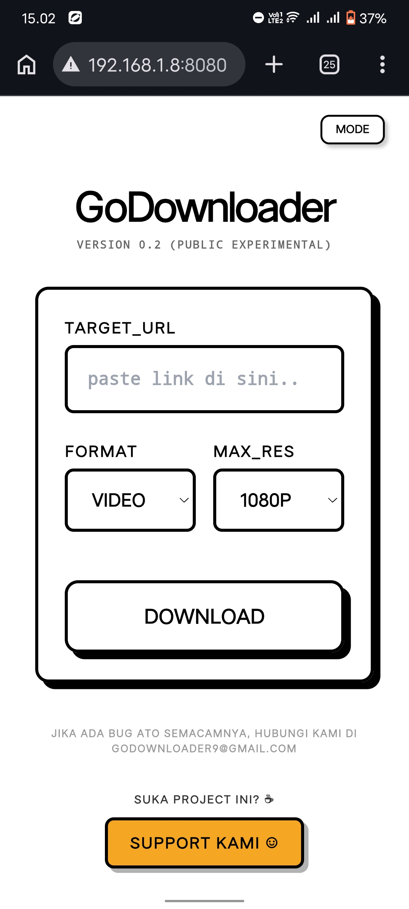
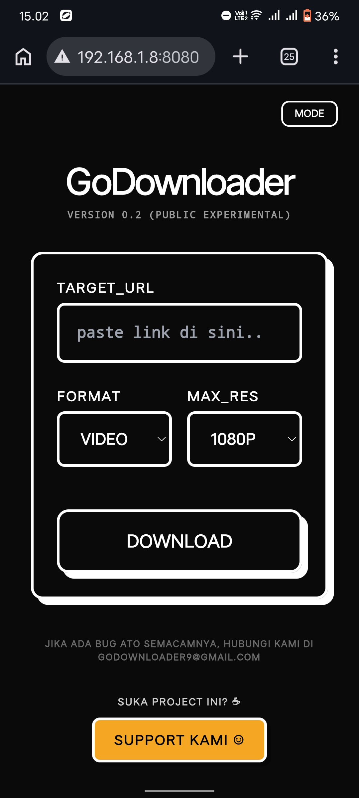
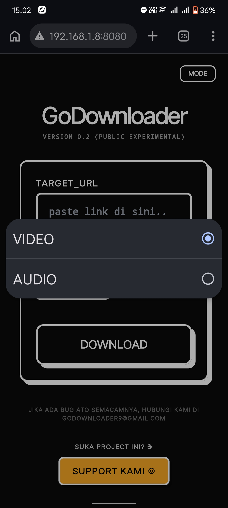
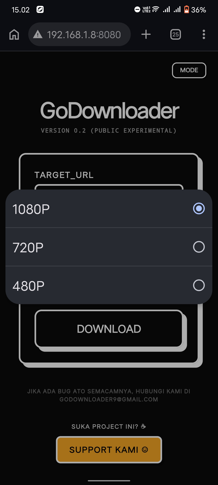

<div align="center">


# Go-Downloader


</div>

---

## About

> Go-Downloader is an open-source, web-based video downloader designed to run on your own server.  
> Support YouTube, Instagram, Pinterest, and various other platforms via yt-dlp.  
> Output: MP4 & MP3.

> Go-Downloader adalah project Open Source web-based video downloader yang bisa jalan di server sendiri.  
> Support YouTube, Instagram, Pinterest, dan platform lainnya via yt-dlp.  
> Output: MP4, MP3.

---

## Screenshots

<div align="center">
<table>
  <tr>
    <td></td>
    <td></td>
    <td></td>
    <td></td>
  </tr>
</table>
</div>

---

## Installation

### Prerequisites
```bash
sudo apt install yt-dlp ffmpeg chromium
```

### Run
```bash
git clone https://github.com/N1K7z/Go-Downloader.git
cd Go-Downloader
go mod tidy
go run main.go
```

Buka **http://localhost:8080**

### Build binary
```bash
go build -o go-downloader .
./go-downloader
```

### Cookie support (opsional)
```bash
cp /path/to/cookies.txt ./cookies.txt
```
